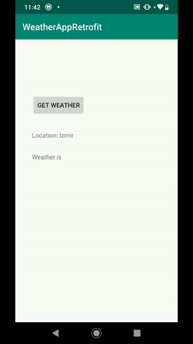
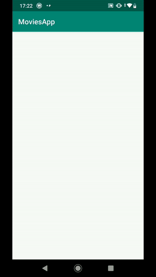

# Kotlin-Tutorial
Includes my Kotlin syntax notes  
- **KotlinTutorial** project is about Kotlin syntax.   
- **WeatherApp** project demonstrates a simple Retrofit usage example . 
  

  
- **Movies** project demonsrates usages of RxJava, RxAndroid and Retrofit together in Kotlin.
  

- **andfun_kotlin-android-trivia-starter-code app**   for lesson 3 of the [Android App Development in Kotlin course on Udacity](https://www.udacity.com/course/developing-android-apps-with-kotlin--ud9012).

The Android Trivia application is an application that asks the user trivia questions about Android development.  It makes use of the Navigation component within Jetpack to move the user between different screens.  Each screen is implemented as a Fragment.
The app navigates using buttons, the Action Bar, and the Navigation Drawer.

  
 ## Coroutines notes:  
 #### Why Kotlin Coroutines?  
 - A **suspending function** is simply a function that can be paused and resumed at a later time. So these type of function can execute o long running operation and wait for it to complete without blocking.  
- So simpler than other methods like RxJava, LiveData … . 
-  Suspend functions suspend the execution of the coroutine without blocking the current thread. Thus, the thread starts to operate another corutine and the CPU is used more efficiently.  
(Suspend functionlar, mevcut threadi bloke etmeden coroutinin yürütülmesini askıya alır. Böylelikle thread başka bir corutinenin işletilmesine başlar ve cpu daha verimli bir şekilde kullanılmış olur.
)    
-  All coroutines can be exist in a single thread.  

-  delay(1000) -> delays coroutine for 1 second . 
   Thread.sleep(1000) ->delays whole coroutine for 1 second in thread,  
   
-  3 types of coroutines ->  
 **default** -> heavy computational interactions like filter,  
**IO** -> for network and local database interactions, executed on background thread,  
**Main** -> for doing things on main thread and interacting with UI
  
  
- withContext(Main) {
} —> Switches coroutine context to main thread . 


- ``` withContext(IO) {   
	val job = withTimeoutOrNull(TIMEOUT_CONSTANT) {   
     val result = getResultFromAPI1()   
     val result2 = getResultFromAPI2()  
		  ...  
	}  
	if(job == null)  
	{   
	  	//timeout message  
	}  
 
---  
#### LiveData
- Ensures your UI matches your data state,
- LiveData follows observer pattern
- LiveData notifies Observes when lifecycle state changes
- Clean code structure
- On configuration changes, like device rotation, immediately latest available data is received . 

--- 
#### Dependency Injection  
- Loosely coupled code
- Easy testing
- Classes are not directly dependent on each other  
---   
#### Other Notes 
- **@Volatile** annotation means this variable immediately visible to all the threads  
- “Unit" in Kotlin is equivalent of "void" in Java.  
---   
#### Navigation Architecture  
- **Navigation Graph**: The part where we can visualize and edit all the navigations that can be done in the application, even the possible routes that the user can take.
- **NavController**: An object that follows the current position in the navigation chart
- **NavHostFragment** is the parent in the view hierarchy of our current fragment.  
- Navigation graph gives a good insight into how users are going to use your app right
  Gives an idea to developers to how app is complicated to user  
- **Explicit Intents** -> Explicit intent is used to launch an activity using the name of the target activity class and they are typically used to launch other activities within your application.  
- **Implicit Intents** -> Implicit  intents provide an abstract description of the operation to be performed  and they most often are used to launch activities that are exposed by other applications.  
Implicitly launched activities require an intent-filter. An intent-filter used to expose that your activity can respond to an implicit intent with a certain action category and/or type.  
- **SafeArgs Plugin** is a Gradle Plugin that generates code to help guarantee that the arguments on both side matches up while also simplifying argument passing.  
**What are advantages we get from using safe arguments?**    
We get type safety, as navigation generates the action and the argument class from the navigation graph.  
We get argument enforcement, as non-default arguments are required parameters in the action.
